# Bidera Store

## Overview
Welcome to Bidera Store, your one-stop online shop for fresh and high-quality food products ranging from vegetables, beef, pork, goat meat, seafood, rice, fish, and much more. "Bidera" is an expression in Kriolo from Guinea Bissau, referring to itinerant vendors who sell vegetables in the markets and streets of Bissau, embodying our commitment to bringing the vibrant and rich flavors of local produce right to your doorstep. Our platform is designed to provide a seamless and convenient shopping experience, allowing customers to purchase products by quantity and enjoy home delivery services.

[Here is the live version of the project](https://bidera-store-4f0dc6400eda.herokuapp.com/)

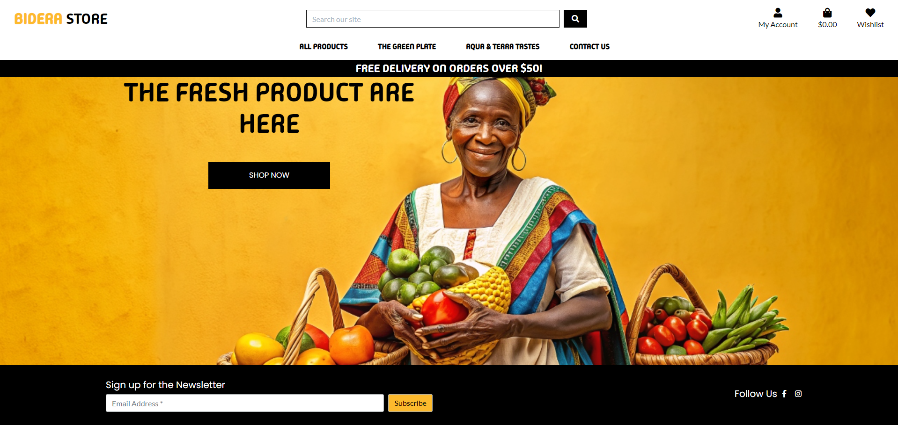

## Strategy

**Project Objectives**
Bidera Store aims to revolutionize the way people shop for food online by offering a wide selection of fresh products, customizable quantities, and efficient home delivery. Our goal is to ensure that every household has access to quality food products without the hassle of visiting physical stores.

## User Stories

### Newsletter Subscription
As a **shopper** I can **subscribe to the newsletter** so that **I receive updates on new products, promotions, and other news related to the store.**

### Acceptance Criteria
- Acceptance criteria 1: The subscription form should be easily accessible and visible on the homepage and other strategic locations across the website to encourage subscriptions.
- Acceptance criteria 2: The user must be able to subscribe by simply entering their email address and clicking the subscribe button, without the need for creating an account or providing additional unnecessary information.
- Acceptance criteria 3: Upon successful subscription, the user should receive immediate visual confirmation on the website and a welcome email confirming their subscription and outlining what type of content they can expect to receive.


### Registration and User Accounts
- As a **Site User** I can **EasilySign up with google authentication** so that i can **Avoid introducing a password and information details on regsitration**

- As a **Site User** I can **Easily register for an account** so that **Have a personal account and be abble to view my profile**

- As a **Site User** I can **Easily login or logout** so that i can **Access my personal account information**

- As a **Site User** I can **Easily recover my password in case i forgot it** so that i can **Recover access to my account**

- As a **Site User** I can **Receive an email confirmation after registering** so that i can **Access my personal account information**

- As a **Site User** I can **have a personalized user profile** so that i can **View my personal order history and order confirmations, and save my payment information**


### Contact Story
As a **User** I can **easily contact the store team through a form on the contact page** so that **I can ask questions, request information about products, seek support, or express my concerns quickly and directly**

### Acceptance Criteria
- Acceptance criteria 1: Easy access to the contact form: Users should easily find the contact option on the website, ideally from the main menu or footer on all pages.

- Acceptance criteria 2: Intuitive contact form: The form should be clear and simple, asking for essential information like name, email, subject, and the message.

- Acceptance criteria 3: Form validation: Before submission, the system should validate the information input by the user, such as the correct formatting of the email.

- Acceptance criteria 4: Feedback after submission: After submitting, the user should receive feedback, either on the same page or via email, confirming that the message has been received.


### Viewing and Navigation
- As a **shopper** I can **easy view a list of products** so that i can **select some purchase**

- As a **Shopper** I can **view individual product details** so that i can **Identify the price, description, product rating, product image**

- As a **shopper** I can **Quickly identify deals, clearance items and special offers** so that i can  **take advantage of special savings on the products i'd like to purchase**

- As a **shopper** I can **Easily view the total of my purchases at any time** so that i can **avoid spending too much**


### Wishlist Feature
As a **user** I can **add and remove products from my wishlist ** so that ** I can easily keep track of items I am interested in purchasing later.**

### Acceptance Criteria

- Acceptance criteria 1: As a registered user, when I navigate to a product detail page, I should see a heart icon indicating whether the product is already in my wishlist or not. If the product is not in the wishlist, clicking the heart icon should add the product to my wishlist, and the icon should change to reflect that it's been added.

- Acceptance criteria 2: The wishlist feature should be accessible only to logged-in users. Users who are not logged in should be prompted to log in when trying to add a product to the wishlist or when attempting to access the wishlist page.

- Acceptance criteria 3: As a registered user, I should be able to view my wishlist from a dedicated wishlist page.


### Admin and Store Management
- As a **Store Owner** I can **Add product** so that I can **Add new Items to my store**

- As a **Store Owner** I can **Edit/update a product** so that I can **Change product prices, descriptions, images, and other product criteria**

- As a **Store Owner** I can **Delete a product** so that I can **Remove items that are no longer for sale**


### Purchasing and Checkout
- As a **Shopper** I can **Easily select the quantity of a product when purchasing it** so that I can **Ensure i dont accidentally select the wrong product quantity**

- As a **Shopper** I can **View Items in my bag to be purchased** so that I can **Identify the total cost of my purchase and all items I will receive**

- As a **Shopper** I can **Adjust the quantity of my individual items in my bag** so that I can **Easily make changes to my purchase before checkout**

- As a **Shopper** I can **Enter my payment information** so that I can **Checkout quickly and with no hassles**

- As a **Shopper** I can **Feel my personal and payment is safe and secure** so that I can **Confidently provide the needed information to make a purchase**

- As a **Shopper** I can **View and order confirmation after checkout** so that I can **verify that I haven't made any mistakes**

- As a **Shopper** I can **Receive an email confirmation after checking out** so that I can **keep the confirmation of what I've purchased for my records**


### Sorting and Seaching
- As a **Shopper** I can **Sort the list of available products** so that i can **Easily identify the best rated, Best priced and categorically sorted products**

- As a **Shopper** I can **Sort a specific category of product** so that i can **Find the best-priced or best-rated product in a specific category, or sort the products in that category by name**

- As a **Shopper** I can **Sort multiple categories of products simultaneously** so that i can **find the best-priced or best rated products across broad categories, such as "fruits" or "meat"**

- As a **Shopper** I can **Search a product by name or description** so that i can **Find a specific product i'd like to purchase**

- As a **Shopper** I can **Easily see what I've  searched for and the number of results** so that i can **Quickly decide whether the product I want is available**


## Skeleton 

### Database Schema

The database schema of Bidera Store is designed to efficiently manage products, orders, and deliveries. The schema includes tables for `Products`, `Wishlist`, `OrderItems`, `Category`, `Users`, and `Checkout`.

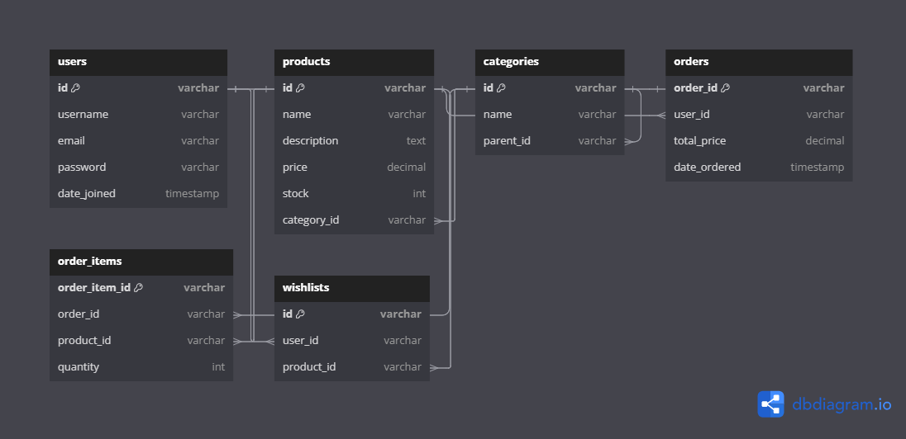

### Models

Our application utilizes Django models to represent and interact with the database. Below are key models used in Bidera Store:

<details>

### Checkout Models
<summary>Order Model</summary>

```python

class Order(models.Model):
    order_number = models.CharField(max_length=32, null=False, editable=False)
    user_profile = models.ForeignKey(UserProfile, on_delete=models.SET_NULL, null=True, blank=True, related_name='orders')
    full_name = models.CharField(max_length=50, null=False, blank=False)
    email = models.EmailField(max_length=254, null=False, blank=False)
    phone_number = models.CharField(max_length=20, null=False, blank=False)
    country = CountryField(blank_label='Country *', null=False, blank=False)
    postcode = models.CharField(max_length=20, null=True, blank=True)
    town_or_city = models.CharField(max_length=40, null=False, blank=False)
    street_address1 = models.CharField(max_length=80, null=False, blank=False)
    street_address2 = models.CharField(max_length=80, null=True, blank=True)
    county = models.CharField(max_length=80, null=True, blank=True)
    date = models.DateTimeField(auto_now_add=True)
    delivery_cost = models.DecimalField(max_digits=6, decimal_places=2, null=False, default=0)
    order_total = models.DecimalField(max_digits=10, decimal_places=2, null=False, default=0)
    grand_total = models.DecimalField(max_digits=10, decimal_places=2, null=False, default=0)
    original_bag = models.TextField(null=False, blank=False, default='')
    stripe_pid = models.CharField(max_length=254, null=False, blank=False, default='')

    def _generate_order_number(self):
        """
        Generate a random, unique order number using UUID
        """
        return uuid.uuid4().hex.upper()

    def update_total(self):
        """
        Update grand total each time a line item is added,
        accounting for delivery costs.
        """
        self.order_total = self.lineitems.aggregate(Sum('lineitem_total'))['lineitem_total__sum'] or 0
        self.grand_total = self.order_total + self.delivery_cost
        self.save()

    def save(self, *args, **kwargs):
        """
        Override the original save method to set the order number
        if it hasn't been set already.
        """
        if not self.order_number:
            self.order_number = self._generate_order_number()
        super().save(*args, **kwargs)

    def __str__(self):
        return self.order_number
```
**Description:**
- The Order model is central to the checkout app, tracking each transaction made on the site.
- It includes comprehensive information about the order, such as customer details, shipping address, and financial totals.
- Unique order numbers are generated using UUID, ensuring each order is easily identifiable.
- Methods like _generate_order_number and update_total handle order numbering and financial calculations, respectively, facilitating accurate order processing and management.

</details>
<details>

<summary>OrderLineItem Model</summary>

```python

class OrderLineItem(models.Model):
    order = models.ForeignKey(Order, null=False, blank=False, on_delete=models.CASCADE, related_name='lineitems')
    product = models.ForeignKey(Product, null=False, blank=False, on_delete=models.CASCADE)
    quantity = models.IntegerField(null=False, blank=False, default=0)
    lineitem_total = models.DecimalField(max_digits=6, decimal_places=2, null=False, blank=False, editable=False)

    def save(self, *args, **kwargs):
        """
        Override the original save method to set the lineitem total
        and update the order total.
        """
        self.lineitem_total = self.product.price * self.quantity
        super().save(*args, **kwargs)

    def __str__(self):
        return f'SKU {self.product.sku} on order {self.order.order_number}'  
```
**Description:**
- This model details individual items within an order, linking products to their respective orders and quantifying each item.
- The lineitem_total field calculates the total cost of each product line, contributing to the overall order total.
- Overriding the save method ensures that lineitem_total is always accurately calculated and that changes are reflected in the order’s grand total.

</details>
<details>

### Contact Models
<summary>Contact Model</summary>

```python

class Contact(models.Model):
    name = models.CharField(max_length=255)
    email = models.EmailField()
    subject = models.CharField(max_length=255)
    message = models.TextField()
    created_at = models.DateTimeField(auto_now_add=True)

    def __str__(self):
        return f"Message from {self.name}"
```
**Description:**
- The Contact model acts as a repository for messages sent by site visitors, encapsulating essential information needed to facilitate communication.
- It comprises several fields to capture the sender's name, email address, the subject of the message, and the message itself. Additionally, the model automatically records the time the message was created (created_at), aiding in organizing and responding to messages in a timely manner.
- The __str__ method provides a human-readable representation of each contact instance, making it easier to identify messages in the admin interface or debug logs by displaying the sender's name.

</details>
<details>

### Product Models
<summary>Category Model</summary>

```python

class Category(models.Model):
    class Meta:
        verbose_name_plural = 'Categories'
        
    name = models.CharField(max_length=254)
    friendly_name = models.CharField(max_length=254, null=True, blank=True)

    def __str__(self):
        return self.name

    def get_friendly_name(self):
        return self.friendly_name

```
**Description:**
- The Category model serves as a way to group products into logical categories, making it easier for users to navigate and find products of interest.
- It contains two main fields: name for the database-friendly name of the category, and friendly_name for a more human-readable version that can be displayed on the site.
- The Meta class with verbose_name_plural = 'Categories' ensures that Django refers to this model in the plural form correctly in the admin interface.
- The __str__ method returns the category's name, and the get_friendly_name method provides a way to retrieve the category's friendly name, enhancing readability and user experience.

</details>
<details>

<summary>Product Model</summary>


```python

class Product(models.Model):
    category = models.ForeignKey('Category', null=True, blank=True, on_delete=models.SET_NULL)
    sku = models.CharField(max_length=254, null=True, blank=True)
    name = models.CharField(max_length=254)
    description = models.TextField()
    quantity_per_kg = models.CharField(max_length=12, null=True, blank=True)
    price = models.DecimalField(max_digits=6, decimal_places=2)
    rating = models.DecimalField(max_digits=6, decimal_places=2, null=True, blank=True)
    image_url = models.URLField(max_length=1024, null=True, blank=True)
    image = models.ImageField(null=True, blank=True)

    def __str__(self):
        return self.name
```
**Description:**
- The Product model captures detailed information about each product offered on the platform.
- It is linked to the Category model through a ForeignKey, allowing products to be categorized. This relation includes on_delete=models.SET_NULL to avoid deleting products if their category is removed.
- Fields such as sku, name, description, and price store essential product details, while quantity_per_kg replaces the previously used has_sizes field to specify quantities or sizes.
- The model also includes fields for rating, image_url, and image to handle product ratings and images, providing a comprehensive view of each product.
- The __str__ method returns the product's name, facilitating easier identification in the admin interface or debug logs.

</details>
<details>

### Profiles Models
<summary>UserProfile Model</summary>

```python
class UserProfile(models.Model):
    """
    A user profile model for maintaining default
    delivery information and order history.
    """
    user = models.OneToOneField(User, on_delete=models.CASCADE)
    default_phone_number = models.CharField(max_length=20, null=True, blank=True)
    default_street_address1 = models.CharField(max_length=80, null=True, blank=True)
    default_street_address2 = models.CharField(max_length=80, null=True, blank=True)
    default_town_or_city = models.CharField(max_length=40, null=True, blank=True)
    default_county = models.CharField(max_length=80, null=True, blank=True)
    default_postcode = models.CharField(max_length=20, null=True, blank=True)
    default_country = CountryField(blank_label='Country', null=True, blank=True)

    def __str__(self):
        return self.user.username

```
**Description:**
- The UserProfile model is designed to store additional information about users that is not covered by the default Django User model.
- It establishes a one-to-one relationship with the User model, ensuring that each user has a unique profile.
- This model includes fields for storing default delivery information, such as phone number, address, town/city, county, postcode, and country. The use of django_countries.fields.CountryField for the country field provides a user-friendly interface for selecting countries.
- The __str__ method returns the username associated with each profile, simplifying identification in administrative operations or debugging processes.

</details>
<details>

<summary>Signal Receiver for UserProfile</summary>


```python

@receiver(post_save, sender=User)
def create_or_update_user_profile(sender, instance, created, **kwargs):
    """
    Create or update the user profile.
    """
    if created:
        UserProfile.objects.create(user=instance)
    # Existing users: just save the profile
    instance.userprofile.save()

```
**Description:**
- This signal receiver listens for the post_save event of the Django User model. Whenever a User instance is saved, this function is invoked.
- The create_or_update_user_profile function checks whether the save event was triggered by the creation of a new user (if created:). If so, it automatically creates a new UserProfile instance associated with the new user.
- For existing users, the function simply saves the associated UserProfile instance, ensuring that any updates to the user's information are reflected in the profile.
- This automated approach ensures that each user has a corresponding - UserProfile without requiring manual profile creation, enhancing data consistency and user experience.

</details>


<details>

### Wishlist Models
<summary>WishlistItem Model</summary>

```python

class WishlistItem(models.Model):
    user = models.ForeignKey(
            User, on_delete=models.CASCADE, related_name='wishlist_items')
    product = models.ForeignKey(Product, on_delete=models.CASCADE)
    added_date = models.DateTimeField(auto_now_add=True)

    def __str__(self):
        return f"{self.product.name} on {self.user.username}'s wishlist"

```
**Description:**
- The WishlistItem model serves as a bridge between the User model from Django's built-in auth system and the Product model from the products application. It effectively enables users to curate a list of products they are interested in.
- Each instance of WishlistItem represents a single product saved to a user's wishlist. The model includes:
    - A ForeignKey relationship to User, allowing the model to reference which user the wishlist item belongs to. The related_name='wishlist_items' parameter facilitates reverse lookups, enabling easy retrieval of all wishlist items for a specific user.
    - A ForeignKey relationship to Product, indicating which product the wishlist item represents.
    - An added_date field, which automatically captures the datetime when an item is added to the wishlist, providing insights into user behavior and preferences over time.
- The __str__ method returns a string representation of each wishlist item, combining the product name and the username. This enhances readability and helps in identifying wishlist items within the Django admin interface or in debugging output.
</details>

## SEO
For the SEO marketing I used  the [XML-SITEMAPS](https://www.xml-sitemaps.com/details-bidera-store-4f0dc6400eda.herokuapp.com-74dddaa7b.html)
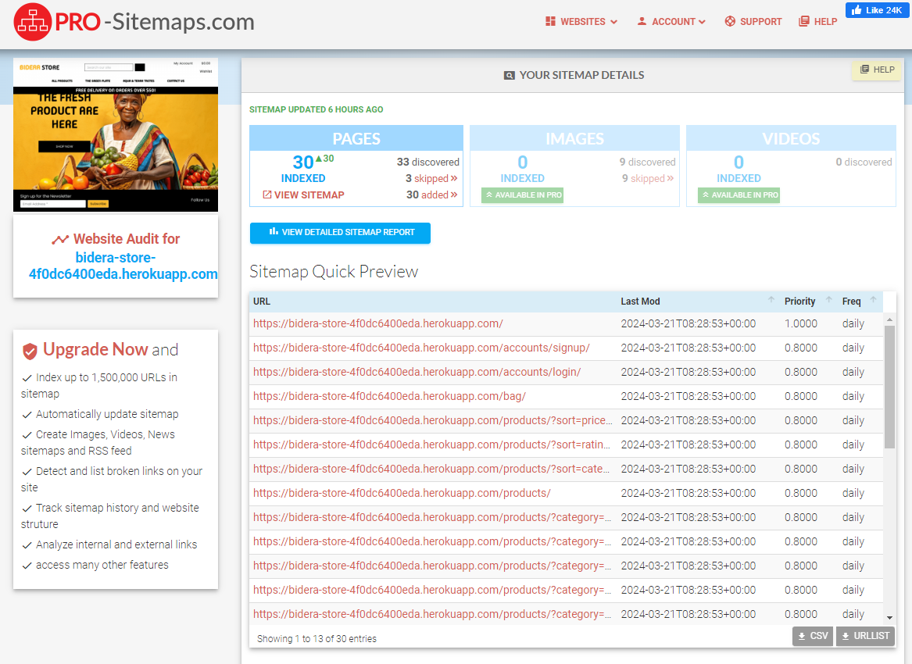

[Page Report](https://pagespeed.web.dev/analysis/https-bidera-store-4f0dc6400eda-herokuapp-com/24sj15nxu1?hl=en&form_factor=desktop)

**Diagnose performance issues**
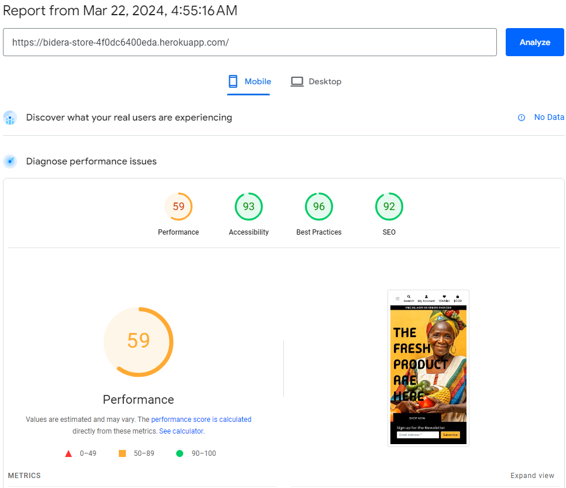

## Social Media Presence

Bidera Store has expanded its online presence beyond the main website to engage with our community and keep our customers informed about the latest products, special offers, and insights into our sustainable practices. Follow us on our social media platforms to stay up to date with all things Bidera Store.

### Facebook

Join our Facebook community to connect with other food enthusiasts, participate in exclusive contests, and get first access to our limited-time offers. Like and follow us on Facebook at [Bidera Store Facebook Page]([https://web.facebook.com/profile.php?id=61557205108337]).

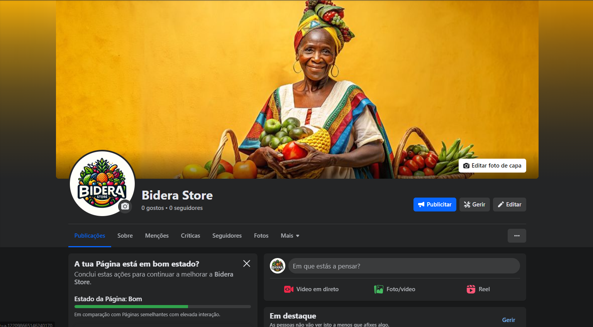

### Instagram

Follow us on Instagram [@bidera_store]([https://www.instagram.com/bidera_store/]) for daily inspiration with food styling, behind-the-scenes looks at our sourcing process, and featured stories from our satisfied customers. Don't forget to tag us in your culinary creations using our products for a chance to be featured on our page!

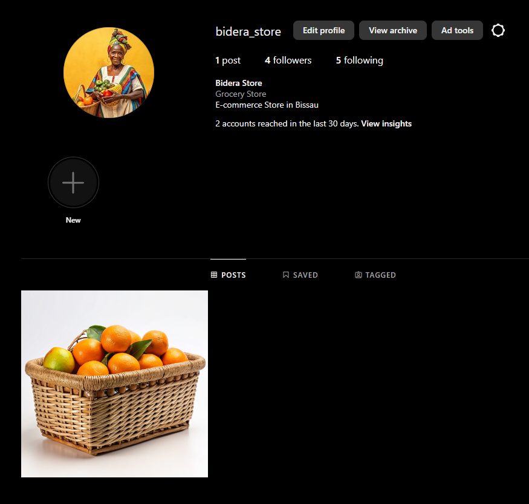

## Marketing Strategy

Our marketing strategy is centered around building a strong relationship with our community through engaging content, educational resources, and interactive campaigns. Through our Facebook and Instagram pages, we aim to:

- Showcase the quality and variety of our products through visually appealing content.
- Educate our followers about the benefits of choosing fresh and high-quality food items.
- Create a platform for customer feedback and testimonials to build trust with potential customers.
- Promote a healthy and sustainable lifestyle that aligns with our brand values.

By leveraging these social media platforms, Bidera Store aims to not only market our products but also to create a community of like-minded individuals who value quality, sustainability, and great food.


## Feature

### Navigation - Home page:

The Bidera Store's homepage is a vibrant entryway into the site, featuring a navigation bar with direct links to product categories and contact information. Central to the page is a compelling image of a woman with fresh fruits and vegetables, symbolizing product quality. The top-right corner offers account access and a wishlist feature, enhancing user engagement. The interface adapts responsively to different devices, ensuring a seamless shopping experience.


### Footer:

The footer of Bidera Store is a streamlined space for engagement, featuring a newsletter sign-up form flanked by social media links. This section encourages users to stay connected and up-to-date with store offerings and news.


### All Products:

The "All Products" page of Bidera Store presents a clean, organized display of available items. Each product is showcased with a high-quality image, price tag, category tag, and a user rating. Users can interact with each product through 'Edit' and 'Delete' options, and a sorting feature enhances the browsing experience.
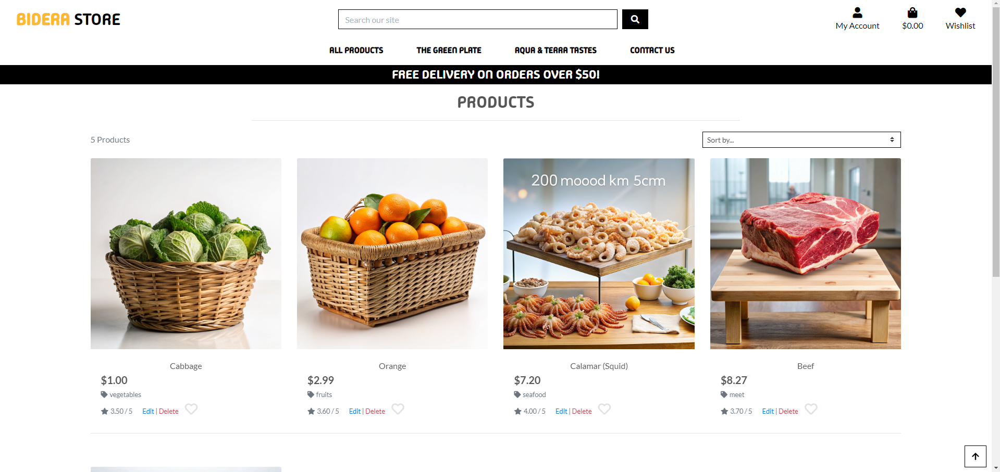

### Product Individual Page:

The product page features an individual item, offering details like price, category, rating, and quantity per kg. A heart icon allows users to add it to their wishlist, while 'Edit' and 'Delete' provide management options. The product description highlights the item's local origin and health benefits, alongside an option for customers to select quantity before adding to their bag, with buttons for purchase or continued shopping.
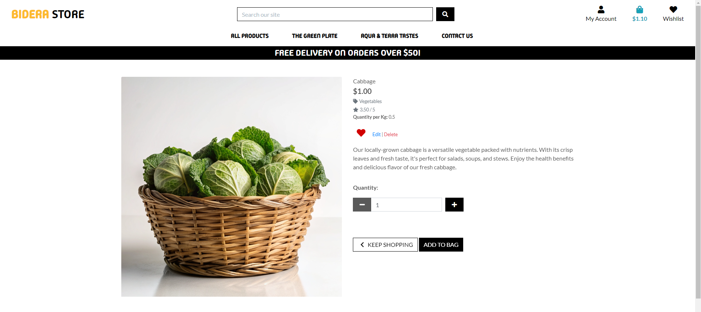

### Bag Page:
The "Bag" page on Bidera Store features a minimalist design where customers can review items they're purchasing. It details the product with an image, name, SKU, price, and a quantity selector with update and remove options. The subtotal is clearly listed alongside the total cost, including delivery, with a prompt for additional purchases to qualify for free delivery. Simple navigation links for "Keep Shopping" and "Secure Checkout" facilitate a smooth shopping experience.
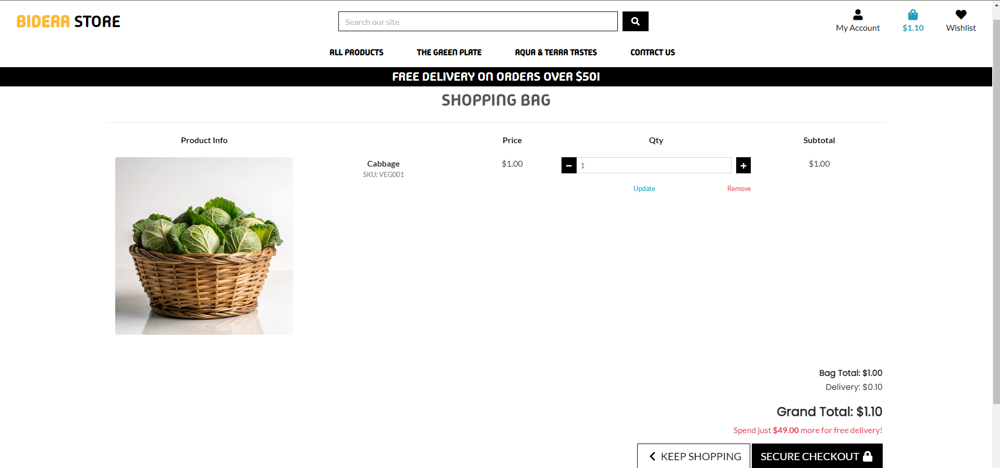

### Checkout page:
The checkout page of Bidera Store is streamlined and user-focused, presenting a form for shipping details alongside an order summary. The summary pane displays product specifics, quantities, and totals, while the form requests essential information for order completion, all within a clean, navigable layout.


### Profile Page:
The profile page on Bidera Store is a user-centric dashboard where customers can update their default delivery information and view their order history. The layout is clean and functional, with fields for phone number, addresses, and location details, alongside a history table that summarizes past orders by number, date, items, and totals. The page simplifies user account management, emphasizing a smooth post-purchase experience.
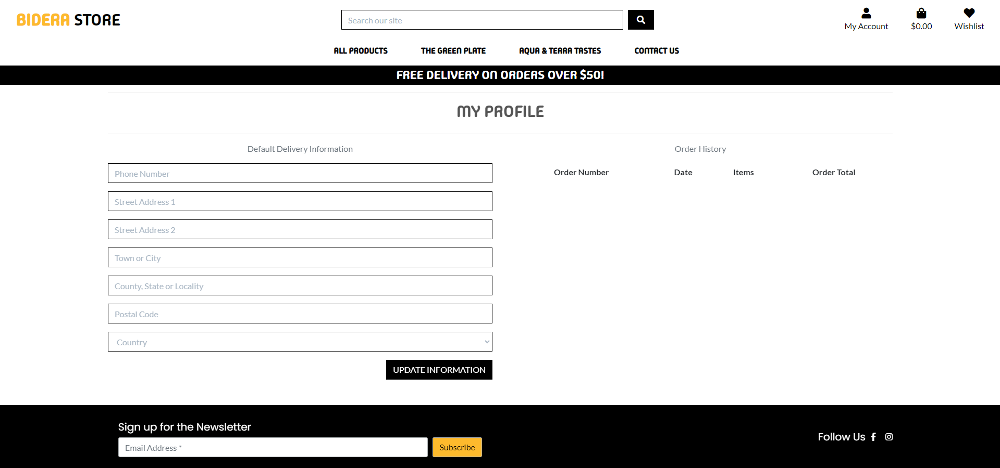

### Product Management Page:
The product management page on Bidera Store provides a straightforward interface for admins to add new products. Fields for category, SKU, name, description, quantity per kg, price, and rating are neatly arranged for easy data entry, with an option to upload an image. Actions to cancel or add the product are clearly visible, streamlining the product inventory process.
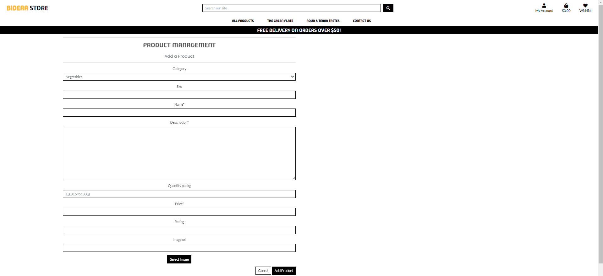

### Wishlist Page:
The wishlist page on Bidera Store displays a curated collection of user-favored items, each with an image, name, description, and price. Shoppers can manage their preferences with 'Add to Bag' or 'Remove' options, streamlining the experience between wishful browsing and actual purchasing.
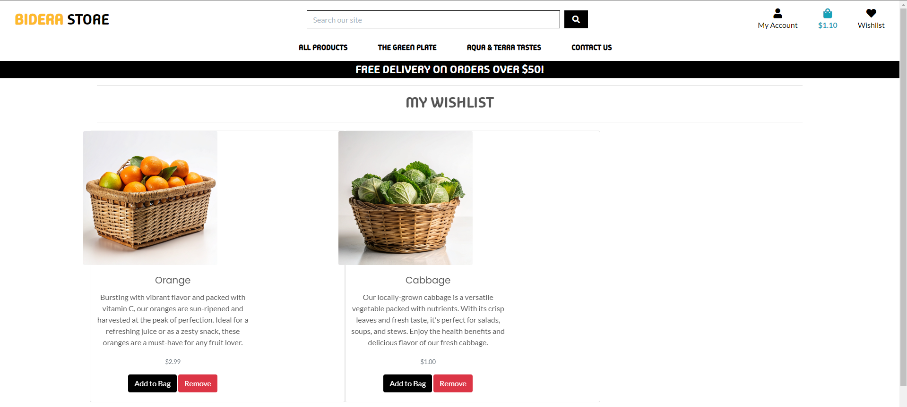

### Add to Bag:
Upon adding an item to their bag, users receive a notification confirming the action, along with a convenient link to the bag for a smooth transition to the checkout process.
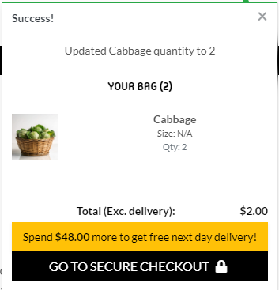

### Sign in
The "Sign In" page on Bidera Store provides a seamless login experience with options for using Google for quick access or using traditional account credentials. There's a clear path for those needing to register or recover passwords, maintaining the site's straightforward and user-friendly design ethos.
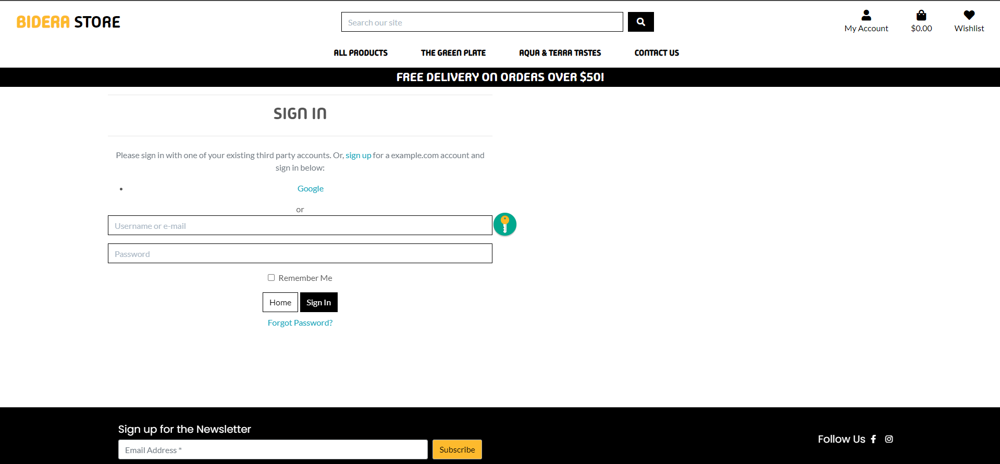
### Sign Up
The "Sign Up" page for Bidera Store offers a straightforward form where new users can create an account. It prompts for email confirmation, a chosen username, and a secure password, with fields for password verification to prevent errors. A link for existing users to sign in ensures ease of navigation for return shoppers. The page maintains the site's clean design and includes a footer inviting newsletter subscription and social media engagement.


### Sign Out
The "Sign Out" page of Bidera Store offers a simple, no-fuss interface, posing the straightforward question, "Are you sure you want to sign out?" Alongside options to either cancel or confirm the action, the page maintains a clean aesthetic, consistent with the site’s overall user-friendly design, ensuring a clear path whether staying logged in or leaving the session.
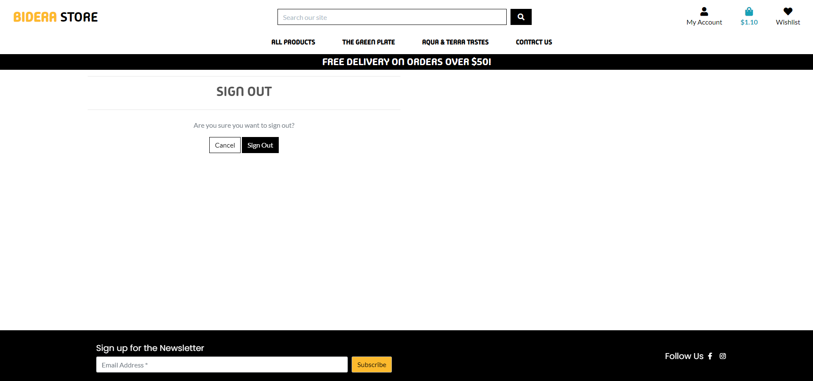

### Wireframes
The wireframe used was based on the Code institute Boutique Ado course project, so the site does not have a new structure.

## Features and Testing

## Testing and Troubleshooting

### Resolving NoReverseMatch Error for 'wishlist'

**Problem Description:**  
The application threw a NoReverseMatch error stating "Reverse for 'wishlist' not found. 'wishlist' is not a valid view function or pattern name." This error indicates that Django's URL dispatcher is unable to find a URL pattern named 'wishlist', critical for rendering the wishlist page or functionality within the application.

**Solution:**  
- **URL Name Does Not Exist:** Ensure a URL pattern named 'wishlist' is defined in one of the urls.py files within the application. If missing, add a corresponding path entry to define this URL pattern.
- **Namespace Issue:** If using application namespaces (e.g., `app_name = 'wishlist'` in the application's urls.py), ensure to include the namespace when referencing the URL in templates or reverse function calls. Correctly prefix the URL name with the namespace, changing `` to `` in templates, and similar adjustments in reverse function calls.

### Resolving TemplateSyntaxError for Custom Tag Library

**Problem:**  
When attempting to access the product detail page, Django throws a TemplateSyntaxError, indicating that the custom tag library 'wishlist_tags' is not registered. The error suggests Django is unable to locate the custom tag library defined in the templatetags directory of the wishlist app.

**Solution:**  
The root cause was the absence of an `__init__.py` file within the templatetags directory of the wishlist app. Django requires each Python directory to contain an `__init__.py` file to be recognized as a package. The presence of this file allows Django and Python to recognize the templatetags directory as a valid module, making the custom template tags available for use in templates.

### Resolving the NoReverseMatch Error for Wishlist URLs

**Problem:**  
The application threw a NoReverseMatch error when attempting to access the product detail page, indicating that the `wishlist_add` and `wishlist_remove` URLs could not be found, suggesting an issue with how URLs were referenced in the template.

**Solution:**  
The error was due to incorrect usage of URL namespacing in the template. The application uses URL namespacing for the wishlist app (`app_name = 'wishlist'` in wishlist/urls.py), requiring specifying both the namespace and the URL name when using the `` template tag. The problem was resolved by correctly prefixing the URL names with the `wishlist:` namespace in the product_detail.html template.


```h

<!-- Correct URL references with namespacing -->

    <a href="" class="btn btn-danger">Remove from Wishlist</a>

    <a href="" class="btn btn-success">Add to Wishlist</a>

```


## Future Development

### Dynamic Pricing
- **Dynamic Pricing Models:** Implement dynamic pricing strategies based on demand, availability, and customer purchasing patterns. This could help optimize sales and inventory levels, ensuring competitive pricing and product freshness.

### Enhanced User Experience with AI
- **Personalized Shopping Experience:** Implement AI-driven recommendations to offer personalized product suggestions based on the browsing history and shopping behavior of each user, enhancing the shopping experience and increasing customer satisfaction.


## Validator Testing
#### **HTML Validation**
I ran the code for all the pages through the [W3C HTML Validator](https://validator.w3.org/) using the textarea input.

| Feature  | Expected Outcome | Result |
| ------------- | ------------- | ------------- |
| Base Page  | Page passes validation with no errors | no error  |
| Home Page  | Page passes validation with no errors | no error  |
| Footer Page  | Page passes validation with no errors | no error  |
| Profile Page  | Page passes validation with no errors | no error  |
| All Accounts Page  | Page passes validation with no errors | no error  |
| All Social accounts Page  | Page passes validation with no errors | no error  |
| Wishlist Page  | Page passes validation with no errors | no error  |
| Checkout Page  | Page passes validation with no errors | no error  |
| checkout_success Page  | Page passes validation with no errors | no error  |
| 404 Page  | Page passes validation with no errors | no error  |
| add_product Page  | Page passes validation with no errors | no error  |
| edit_product Page  | Page passes validation with no errors | no error  |
| product_detail Page  | Page passes validation with no errors | no error  |
| products Page  | Page passes validation with no errors | no error  |
| contact Page  | Page passes validation with no errors | no error  |
| bag Page  | Page passes validation with no errors | no error  |

### **CSS Validation**
- In my project, I conducted a CSS validation test using the Jigsaw W3 CSS Validator for CSS Level 3 + SVG. The test show
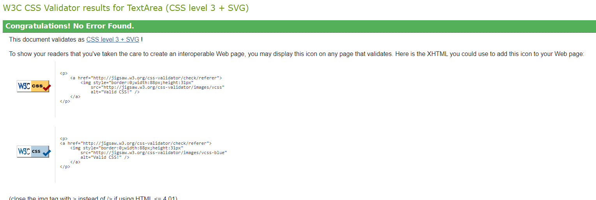

### **Python Linting**
All code passed the validation tests through the [PEP8CI](https://pep8ci.herokuapp.com/). 
| Feature  | Expected Outcome | Result |
| ------------- | ------------- | ------------- |
| bidera_store/views.py  | Page passes validation with no errors | All clear, no errors found  |
| bidera_store/urls.py  | Page passes validation with no errors | All clear, no errors found  |
| bidera_store/settings.py  | Page passes validation with no errors | All clear, no errors found  |
| bag/views.py  | Page passes validation with no errors | All clear, no errors found  |
| bag/urls.py  | Page passes validation with no errors | All clear, no errors found  |
| bag/models.py  | Page passes validation with no errors | All clear, no errors found  |
| bag/forms.py  | Page passes validation with no errors | All clear, no errors found  |
| bag/apps.py  | Page passes validation with no errors | All clear, no errors found  |
| bag/admin.py  | Page passes validation with no errors | All clear, no errors found  |
| bag/context.py  | Page passes validation with no errors | All clear, no errors found  |
| checkout/views.py  | Page passes validation with no errors | All clear, no errors found  |
| checkout/urls.py  | Page passes validation with no errors | All clear, no errors found  |
| checkout/models.py  | Page passes validation with no errors | All clear, no errors found  |
| checkout/forms.py  | Page passes validation with no errors | All clear, no errors found  |
| checkout/apps.py  | Page passes validation with no errors | All clear, no errors found  |
| checkout/admin.py  | Page passes validation with no errors | All clear, no errors found  |
| checkout/signals.py  | Page passes validation with no errors | All clear, no errors found  |
| checkout/webhook_handler.py  | Page passes validation with no errors | All clear, no errors found  |
| checkout/webhook.py  | Page passes validation with no errors | All clear, no errors found  |
| contact/views.py  | Page passes validation with no errors | All clear, no errors found  |
| contact/urls.py  | Page passes validation with no errors | All clear, no errors found  |
| contact/models.py  | Page passes validation with no errors | All clear, no errors found  |
| contact/forms.py  | Page passes validation with no errors | All clear, no errors found  |
| contact/apps.py  | Page passes validation with no errors | All clear, no errors found  |
| contact/admin.py  | Page passes validation with no errors | All clear, no errors found  |
| home/views.py  | Page passes validation with no errors | All clear, no errors found  |
| home/urls.py  | Page passes validation with no errors | All clear, no errors found  |
| home/models.py  | Page passes validation with no errors | All clear, no errors found  |
| home/forms.py  | Page passes validation with no errors | All clear, no errors found  |
| home/apps.py  | Page passes validation with no errors | All clear, no errors found  |
| home/admin.py  | Page passes validation with no errors | All clear, no errors found  |
| products/views.py  | Page passes validation with no errors | All clear, no errors found  |
| products/urls.py  | Page passes validation with no errors | All clear, no errors found  |
| products/models.py  | Page passes validation with no errors | All clear, no errors found  |
| products/forms.py  | Page passes validation with no errors | All clear, no errors found  |
| products/apps.py  | Page passes validation with no errors | All clear, no errors found  |
| products/admin.py  | Page passes validation with no errors | All clear, no errors found  |
| products/widgets.py  | Page passes validation with no errors | All clear, no errors found  |
| profiles/views.py  | Page passes validation with no errors | All clear, no errors found  |
| profiles/urls.py  | Page passes validation with no errors | All clear, no errors found  |
| profiles/models.py  | Page passes validation with no errors | All clear, no errors found  |
| profiles/forms.py  | Page passes validation with no errors | All clear, no errors found  |
| profiles/apps.py  | Page passes validation with no errors | All clear, no errors found  |
| profiles/admin.py  | Page passes validation with no errors | All clear, no errors found  |
| profiles/tests.py  | Page passes validation with no errors | All clear, no errors found  |
| wishlist/views.py  | Page passes validation with no errors | All clear, no errors found  |
| wishlist/urls.py  | Page passes validation with no errors | All clear, no errors found  |
| wishlist/models.py  | Page passes validation with no errors | All clear, no errors found  |
| wishlist/forms.py  | Page passes validation with no errors | All clear, no errors found  |
| wishlist/apps.py  | Page passes validation with no errors | All clear, no errors found  |
| wishlist/admin.py  | Page passes validation with no errors | All clear, no errors found  |
| wishlist/tests.py  | Page passes validation with no errors | All clear, no errors found  |

### **JavaScript Linting**
- The code was tested on [jshint](https://jshint.com/) Without errors.


## Credits

### Code
- During the development of the Bidera Store project, I extensively utilized the tools and resources (Template and resources) provided by the [Code Institute Boutique Ado Project](https://codeinstitute.net/) as the walkthrough project Boutique Ado, also **Chat GPT** for debug the codes error.
- I used [MailChimp](https://mailchimp.com/) for newsletter
- Use Bootstrap [Cheatsheet](https://getbootstrap.com/docs/5.0/examples/cheatsheet/) to better style

### Storage 
- Use the [AWS](https://aws.amazon.com/)


### DataBase
- https://dbdiagram.io/d/Bidera-Store-65f719a9ae072629ce3876e7

### Language Used
- TECHNOLOGIES: 
    - HTML5: To build the main structure of the site
    - CSS3:  To style the website with bootstrap
    - JAVASCRIPT: For the frontend interactivity

### Deployment
- Use Code Institute [Django Deployment Instructions](https://docs.google.com/document/d/1P5CWvS5cYalkQOLeQiijpSViDPogtKM7ZGyqK-yehhQ/edit#heading=h.5s9novsydyp1)

### Heroku Deployment Steps

1. **Sign Up or Log In to Heroku**
   - Visit [Heroku's website](https://www.heroku.com/) and either log in or create a new account.

2. **Create a New App**
   - From the Heroku Dashboard, create a new app. Provide a unique name for your app and select a region that is closest to you or your user base.

3. **Configuration**
   - Navigate to the **Settings** tab of your app on Heroku.
   - In the **Config Vars** section, add your ElephantSQL `DATABASE_URL`.
   - Copy the `DATABASE_URL` for Django configuration.

4. **Environment Variables**
   - Create an `env.py` file in your Django app repository.
   - Set environment variables for `DATABASE_URL` and `SECRET_KEY`.
   - Add these along with any other necessary environment variables to Heroku's Config Vars.

5. **Database Migration**
   - Update `settings.py` in your Django project with the necessary imports and configurations, including database settings.
   - Migrate your models to the new database connection using `python manage.py migrate`.

6. **Static and Media Files Configuration**
   - Create an S3 bucket on Amazon AWS for handling static and media files.
   - Update the Django `settings.py` file and `env.py` with your bucket details.
   - Add AWS access keys and secret access keys to both `env.py` and Heroku Config Vars.

7. **Disable Collectstatic**
   - Temporarily add `DISABLE_COLLECTSTATIC` with a value of 1 to Heroku Config Vars to prevent Heroku from collecting static files.

8. **Dependencies**
   - Ensure all required packages are listed in `requirements.txt` and install them.

9. **Application Settings**
   - Configure static files settings and templates directory within `settings.py`.
   - Add `Heroku` to the `ALLOWED_HOSTS` list in `settings.py`.

10. **Project Structure**
    - Ensure the existence of media, static, and templates folders within your project.

11. **Procfile**
    - Create a `Procfile` in the root of your repository with the command to run your app, e.g., `web: gunicorn your_project_name.wsgi`.

12. **Version Control**
    - Add, commit, and push your changes to GitHub.

13. **Heroku Deployment**
    - Manually deploy your branch on Heroku and monitor the build logs for any errors.
    - Access your live site through the link provided by Heroku upon successful deployment.

## Stripe Integration

1. **Account Setup**
   - Create a Stripe account and access the developer dashboard to obtain your API keys.

2. **Configuration**
   - Insert your Stripe API keys into both `env.py` and Heroku Config Vars.

3. **Integration**
   - Adjust your `settings.py` to point to the required Stripe variables.
   - Follow Stripe's documentation for integrating Stripe within your Django project.

### DATABASES
- [Elephantsql](https://www.elephantsql.com/)

### Language Used
- TECHNOLOGIES: 
    - HTML5: To build the main structure of the site
    - CSS3:  To style the website with bootstrap
    - JAVASCRIPT: For the frontend interactivity
    - PYTHON: To build the backend with django
        - asgiref==3.7.2
        - boto3==1.34.66
        - botocore==1.34.66
        - dj-database-url==0.5.0
        - Django==3.2.24
        - django-allauth==0.41.0
        - django-countries==7.2.1
        - django-crispy-forms==1.14.0
        - django-storages==1.14.2
        - gunicorn==21.2.0
        - jmespath==1.0.1
        - oauthlib==3.2.2
        - pillow==10.2.0
        - psycopg2==2.9.9
        - python3-openid==3.2.0
        - pytz==2024.1
        - requests-oauthlib==1.3.1
        - s3transfer==0.10.1
        - sqlparse==0.4.4
        - stripe==8.5.0
        - urllib3==1.26.18
- FRAMEWORKS: DJANGO, JQUERY, BOOTSTRAP
- VERSION CONTROL: GIT, GITHUB

### Text
- [ChatGPT](https://chat.openai.com/) to generate text for the bidera-store page and formating the readme file
- Description text was generated by [Chat GPT](https://chat.openai.com/)

### Content and Media
- Product images was generated for [Recraft AI Generator](https://www.recraft.ai/)
- The Background Image was generated by [Leonardo AI](https://app.leonardo.ai/)

### Acknowledgements
-   This project, Bidera Store, has been developed with reference to the **Boutique Ado** project from **Code Institute** as a structural and design foundation. I am grateful for the educational content and practical frameworks provided, which have been instrumental in shaping the development of this e-commerce site.
- Special thanks are also due to my mentor, Can Sücüllü, whose guidance and innovative ideas have once again helped me streamline my work and bring this project to fruition. His support and expertise have been invaluable throughout this journey.

